# Switch Please

[](https://github.com/marrakesh/switch-please/actions/workflows/ci.yml)
[](https://github.com/marrakesh/switch-please/releases/latest)
[](LICENSE)
[](https://ko-fi.com/marrakeshgtp)
[](https://www.buymeacoffee.com/marrakesh)

Přepínač rozložení klávesnice pro Windows, který opraví text napsaný ve špatném rozložení.
Napsali jste `yima`, a přitom jste mysleli `zima`, nebo `zes` místo `yes`? Stiskněte dvakrát
Shift: slovo se napíše znovu tak, jak jste ho zamýšleli, a rozložení se přepne, takže
můžete psát dál.

Zdarma a s otevřeným kódem, pro Windows 10 a 11. Ruština, ukrajinština a angličtina
fungují hned, stejně jako čeština a každý další jazyk, pro který má Windows slovník
kontroly pravopisu. Stručně o programu na [webu](https://marrakesh.github.io/switch-please/cs/).

**[English](README.md)** · **[Русская](README.ru.md)** · **[Українська](README.uk.md)** · **[Deutsch](README.de.md)**



- **Dvě klávesové zkratky.** Shift ×2 opraví poslední slovo, Ctrl ×2 výběr nebo celý řádek.
  Hned poté znovu Shift ×2 a slovo je zpátky.
- **Automatická oprava, když ji chcete.** Ve výchozím stavu vypnutá. Když ji zapnete,
  opraví každé slovo, jakmile ho dopíšete — všude, nebo jen v aplikacích, které si vyberete.
- **Správný text nechává být.** Automatická oprava přepíše slovo jen tehdy, když si je
  jistá, že jste ho napsali ve špatném rozložení: v testu na běžném textu nechala všech 233
  správně napsaných slov beze změny. Když si jistá není a slovo nechá být, stiskněte prostě
  Shift ×2 sami.
- **Rozliší ruštinu od ukrajinštiny.** `ghbdsn` je v ruském rozložení `привыт` a v
  ukrajinském `привіт`. Obě vypadají jako slova v cyrilici, takže o tom, které z nich
  existuje, rozhodne slovník.
- **Drží se stranou** od polí pro hesla, her, terminálů a editorů kódu.
- **Soukromí.** Žádná telemetrie, žádné síťové požadavky, dokud sami nezapnete kontrolu
  aktualizací, a nic z napsaného se nezapisuje na disk.
- **Bez práv správce.** Instaluje se jen pro vás, nebo běží jako jediný přenosný
  spustitelný soubor.

## Nejdřív to podstatné pro češtinu

Česká diakritika sedí na číselné řadě: `ě` je tam, kde má americké rozložení `2`, `š` na
`3`, `č` na `4` a tak dál. Slovo s diakritikou tedy dopadne s číslicí uvnitř — a slova
obsahující číslice automatická oprava **zásadně nechává být**, protože jinak by přepisovala
hesla, verze a cesty k souborům. Toto pravidlo běží dřív než jakékoli vyhodnocování.

Klávesová zkratka jím vázaná není a takové slovo opraví. Číslici uprostřed slova nepíše
žádný jazyk, takže vyhraje rozložení, které má na té klávese písmeno — i vedle ruštiny nebo
ukrajinštiny a i bez českého slovníku ve Windows. Výjimkou jsou `ů` a `ú`, které sedí tam,
kde má americké rozložení `;` a `[`: slovo, které má jen je, jako `dům` nebo `úkol`, zkratka
spolehlivě neopraví.

Prakticky to znamená:

| Napsané | Zamýšlené | |
|---|---|---|
| `yima` | zima | **opraví** — jen prohozené y/z |
| `jayzk` | jazyk | **opraví** |
| `ynovu` | znovu | **opraví** |
| `d2kuji` | děkuji | **opraví Shift ×2**; automaticky ne — obsahuje číslici |
| `m2sto` | město | **opraví Shift ×2**; automaticky ne — obsahuje číslici |
| `p59li3` | příliš | **opraví Shift ×2**; automaticky ne — obsahuje číslici |

Automatická oprava tedy pomůže tam, kde jde o prohození `y` a `z` mezi QWERTZ a americkým
rozložením; slova s diakritikou opraví Shift ×2. Totéž platí pro slovenštinu, která má
diakritiku na číselné řadě také. Maďarština tam má jen `ö`, ostatní její diakritika sedí na
interpunkci.

Opačný směr funguje bez výhrad:

| Napsané | Zamýšlené | |
|---|---|---|
| `zes` | yes | angličtina, aktivní české rozložení |
| `siye` | size | angličtina, aktivní české rozložení |

## Instalace

Stáhněte **`SwitchPlease-Setup.exe`** z
[posledního vydání](https://github.com/marrakesh/switch-please/releases/latest)
(`SwitchPlease-Setup-arm64.exe` na stroji s ARM) a spusťte ho. Instalátor nevyžaduje práva
správce: instaluje se jen pro vás, nabídne spouštění Switch Please se systémem Windows a při
odinstalaci se zeptá, zda ponechat vaše nastavení.

Pokud nechcete nic instalovat, každé vydání obsahuje i přenosné spustitelné soubory. Mimo
`%APPDATA%\SwitchPlease` nezapisují nic:

| Přenosně | Velikost | Vyžaduje |
|---|---|---|
| `SwitchPlease.exe` | ~52 MB | nic |
| `SwitchPlease-arm64.exe` | ~50 MB | nic, na stroji s ARM |
| `SwitchPlease-runtime-required.exe` | ~0,4 MB | [.NET 10 Desktop Runtime](https://dotnet.microsoft.com/download/dotnet/10.0) |
| `SwitchPlease-arm64-runtime-required.exe` | ~0,4 MB | ARM64 verzi .NET 10 Desktop Runtime |

Velké soubory v sobě nesou běhové prostředí .NET; malé jsou tentýž program pro počítač,
který ho už má. Instalátory (~47 MB, ~45 MB pro ARM) velké soubory obalují.

**Windows SmartScreen poprvé varuje.** Soubory zatím nejsou podepsané, takže je jednou
nutné kliknout na *Další informace → Přesto spustit*. Podepisování přes SignPath Foundation
se zavádí a [zásady podepisování kódu](docs/code-signing.md) (anglicky) popisují, co, kdo
a jak bude podepisovat. Do té doby každé vydání obsahuje `SHA256SUMS.txt` vytvořený týmž
během GitHub Actions, který sestavil i samotné soubory, aby se podle něj dal ověřit stažený
soubor:

```powershell
Get-FileHash .\SwitchPlease-Setup.exe -Algorithm SHA256
```

Chcete-li Switch Please odebrat, odinstalujte ho v Nastavení → Aplikace. Přenosný
spustitelný soubor po sobě nezanechá nic kromě sebe samého a `%APPDATA%\SwitchPlease`.

## Začínáme

Switch Please sídlí v oznamovací oblasti a jeho ikona ukazuje aktuální rozložení. Při
prvním spuštění malé okno ukáže obě klávesové zkratky s krátkou ukázkou; poté zůstává
zticha. Pokud ikonu nevidíte, je pod šipkou ^ — přetáhněte ji na hlavní panel, ať je na
očích.

| Klávesy | Co se stane |
|---|---|
| **Shift ×2** | Opraví poslední slovo a přepne rozložení. Stisknuto hned znovu, vrátí slovo zpět. |
| **Ctrl ×2** | Opraví výběr, a když není nic vybráno, celý řádek, a přepne rozložení. |
| Zpět | Vrátí poslední opravu, i převedený výběr. Ve výchozím stavu nepřiřazeno. |
| Automaticky | Opraví každé slovo, jakmile je dopsané. Ve výchozím stavu vypnuto. |

Dvojí stisk jsou dva rychlé stisky samotné klávesy, mezi nimiž není stisknuto nic jiného.
Při psaní velkých písmen se Shift drží jen kolem jednoho písmene, takže běžné psaní ho
nikdy nespustí.

Všechno ostatní je v nabídce ikony: automatická oprava, klávesové zkratky, zvuk, spouštění
s Windows, aplikace, kterým se má vyhýbat, a *Nastavení...*.

## Co to dělá

### Poslední slovo: Shift ×2

Pracuje se záznamem toho, co jste napsali, takže není třeba nic vybírat. Záznam se zahodí,
kdykoli se kurzor přesune tam, kam ho záznam nemůže sledovat — Enter, Tab, šipky, Home/End,
Esc, jakékoli kliknutí myší —, protože jednat podle zastaralého záznamu by smazalo text,
který jste nikdy nenapsali. Poté text vyberte a použijte Ctrl ×2.

### Výběr nebo řádek: Ctrl ×2

Když je vybrán text, převede přesně ten a žádný záznam nepotřebuje, takže funguje i poté,
co jste kurzor přesunuli. Když není nic vybráno, vezme vše napsané od posledního pohybu
kurzoru, což je obvykle celý řádek.

Přečtení výběru znamená půjčit si schránku. Cokoli v ní bylo — text, formátování, obrázek,
seznam souborů — se potom vrátí zpět.

### Automatická oprava

Zapíná se položkou *Rozpoznávat špatné rozložení automaticky* v nabídce v oznamovací
oblasti. Každé slovo se posoudí, když po něm stisknete mezerník, a přepíše se, jen když se
jiné rozložení čte zřetelně lépe. Jak moc lépe, určuje *Opatrnost při automatické opravě*
v *Nastavení...*.

Nemusí to být všechno, nebo nic. *Automaticky opravovat v …* v nabídce v oznamovací oblasti
ji zapne nebo vypne pro aplikaci, ve které právě jste, takže může fungovat v prohlížeči a
nechat na pokoji editor, kde jsou klávesové zkratky pořád na jeden stisk.

### Vrácení opravy a slova, která se naučí nechat být

Zpět vrátí poslední opravu, pokud jste od té doby nic nenapsali. U slova totéž udělá znovu
Shift ×2. Zkratka Zpět vrací i převedený výběr, což Shift ×2 neumí; ve výchozím stavu není
přiřazená a přiřadí ji *Klávesové zkratky...* v nabídce v oznamovací oblasti.

Vrácení **automatické** opravy ji navíc něco naučí: slovo se dostane na seznam, kterého si
automatická oprava od té chvíle nevšímá — příjmení, přihlašovací jméno, slovo v jazyce bez
modelu. Oznámení slovo jmenuje a v *Nastavení...* → *Tato slova nikdy neopravovat
automaticky* se dá seznam číst i upravovat. Klávesové zkratky na tato slova dál fungují.

### Zapomenutý Caps Lock

Opraví se spolu s rozložením: z `aHOJ` bude `Ahoj` a Caps Lock se vypne. Pozná se to podle
Shiftu: se zapnutým Caps Lockem ho drží jen ten, kdo neví, že je zapnutý — velká písmena
napsaná záměrně, bez Shiftu, proto zůstanou. Automatická oprava to dělá také, pokud je
zapnutá.

### Rozložení u textového kurzoru

*Zobrazovat rozložení u textového kurzoru* v nabídce v oznamovací oblasti na chvíli ukáže
pod kurzorem malou značku — `CS`, `EN` — kdykoli se rozložení změní, ať už jste ho přepnuli
vy, nebo oprava. Zmizí při prvním stisku klávesy nebo kliknutí, jinak sama za vteřinu; jak
dlouho zůstane, se nastaví v *Nastavení...*. Ve výchozím stavu vypnuto.

Aplikace k tomu musí prozradit, kde má kurzor. Běžné programy Windows, Office a prohlížeče
to dělají; aplikace, které si text kreslí samy a Windows o tom neřeknou — některé editory na
Electronu, terminály —, ne, a tam se značka neukáže.

### Změna klávesových zkratek

Všechny tři lze přeřadit v *Klávesové zkratky...* v nabídce v oznamovací oblasti. Dialog
zachytí to, co skutečně stisknete: dvojí stisk Shift nebo Ctrl, nebo běžnou kombinaci jako
`Ctrl+Shift+L`. Backspace přiřazení zruší.

## Příklady

Co dopadne, když bylo rozložení špatné, a na co to klávesová zkratka změní:

| Napsané | Zamýšlené | |
|---|---|---|
| `ghbdtn rfr ltkf` | привет как дела | ruština, aktivní americké rozložení |
| `cgfcb,j` | спасибо | ruština, aktivní americké rozložení |
| `руддщ` | hello | angličtina, aktivní ruské rozložení |
| `ерфтлы` | thanks | angličtina, aktivní ruské rozložení |
| `gHBDTN` | Привет | ruština, aktivní americké rozložení, zapomenutý Caps Lock |
| `пРИВЕТ` | Привет | zapomenutý Caps Lock, rozložení je správné |
| `привыт` | привіт | ukrajinština, aktivní ruské rozložení |
| `мысто` | місто | ukrajinština, aktivní ruské rozložení |

Poslední dva jsou těžký případ. Ruské a ukrajinské rozložení sdílejí všechny klávesy kromě
několika (mimo jiné ы/і, э/є, ъ/ї), takže výsledek je tak či onak obyčejná cyrilice a
statistika písmen je nerozliší. Slovník Windows ano: takové ruské slovo neexistuje.

A co automatická oprava záměrně nechává být:

| Nechává se být | Proč |
|---|---|
| `ok`, `hi` | Kratší než tři znaky |
| `test123` | Obsahuje číslice |
| `C:\Windows\System32` | Vypadá jako cesta |
| `user@example.com` | Vypadá jako adresa |
| `camelCase`, `getUserName` | Smíšená velikost písmen uvnitř slova |
| `NASA` se zapnutým Caps Lockem | Záměrná velká písmena: Shift nebyl stisknut |
| `příliš`, `Grüße` | Pro tento jazyk není model ani slovník, takže se zdrží |

Klávesové zkratky se těmito pravidly neřídí: stisk je žádost, takže převádějí. Přesto
odmítnou text, který se už čte zřetelně lépe než každá alternativa, a právě to brání tomu,
aby náhodný dvojí stisk pokazil správně napsané slovo.

## Kde se drží stranou

Čtyři pojistky, všechny ve výchozím stavu zapnuté:

- **Pole pro hesla.** Rozpoznávají se dvěma nezávislými sondami a nikdy se nečtou.
- **Hry a prezentace.** Nic se neděje, dokud obrazovku zabírá aplikace přes celou plochu,
  takže dvojí stisk Shiftu při sprintu zůstane dvojím stiskem Shiftu při sprintu.
  Vzdálená plocha přes celou obrazovku mezi ně nepatří: je to plocha, do které se píše.
- **Vyloučené aplikace.** Správci hesel, terminály a editory kódu — Visual Studio, VS Code,
  Cursor, IDE od JetBrains a několik dalších — jsou vyloučené hned po instalaci, protože se
  tam píšou většinou hesla, příkazy a identifikátory. *Nikdy nespouštět v …* v nabídce
  v oznamovací oblasti přidá aplikaci, ve které právě jste; celý seznam je v *Nastavení...*.
- **Čínský, japonský a korejský vstup.** Skládání textu se nechává být — není tam žádné
  špatné rozložení, které by šlo vracet.

## Jazyky

Jazyky, mezi kterými opravuje, jsou **rozložení klávesnice nainstalovaná ve Windows**, ne
seznam ve zdrojovém kódu. Stačí rozložení přidat a Switch Please si toho do vteřiny
všimne. Při třech a více rozloženích vybere to, ve kterém se text čte nejlépe.

Ruština, ukrajinština a angličtina mají vestavěné modely. Každý další jazyk — včetně
češtiny — se posuzuje podle **slovníku kontroly pravopisu Windows**, který se instaluje
spolu s jazykem: Nastavení → Čas a jazyk → Jazyk a oblast → Přidat jazyk, se zaškrtnutým
„Základní psaní“. Jazyk, který nemá ani jedno, se zdrží místo hádání. *Stav a latence...*
v nabídce v oznamovací oblasti ukáže, které slovníky máte.

Rozhraní je česky, anglicky, rusky, ukrajinsky a německy. Řídí se jazykem zobrazení
Windows, pokud v nabídce v oznamovací oblasti pod *Jazyk* nezvolíte jiný, a světlým či
tmavým nastavením Windows.

## Soukromí

**Žádné síťové požadavky, dokud o ně nepožádáte.** Žádná telemetrie, žádná analytika, žádná
hlášení o pádech, žádná kontrola licence. Jediný kód, který otevírá socket, je kontrola
aktualizací: zeptá se GitHubu na značku posledního vydání, nesděluje o vás nic a je **ve
výchozím stavu vypnutá**.

Nic z napsaného neopouští počítač a ve výchozím stavu se na disk nezapisuje nic kromě
nastavení. Jediný napsaný text, který se může v nastavení ocitnout, je slovo, na které jste
sami ukázali: vrácení automatické opravy ho zařadí na seznam „neopravovat“, oznámení to
řekne a *Nastavení...* seznam ukáže a umožní slovo zase odebrat.

Diagnostický protokol existuje, jen dokud je zapnuté *Měřit latenci hooku*, a zaznamenává
rozhodnutí s textem zkráceným na jeho délku:

```
14:22:07 auto: <6 chars> -> <6 chars> [ru=0.94 en=0.11 margin=0.83 after=ru]
```

Samotná slova se objeví, jen když zapnete *Zapisovat napsaný text do protokolu*. Velikost
protokolu je omezená a po dosažení limitu se protokol rotuje.

## Kvalita rozpoznávání

Jak automatická oprava vyvažuje zachycené chyby proti poškozeným slovům, změřeno na 427
ruských a anglických slovech, která v seznamech slov modelu záměrně nejsou. *Zachycené
chyby* je podíl slov napsaných ve špatném rozložení, která opravila; *pokažená správná
slova* je počet správně napsaných slov, která přepsala.

| Opatrnost | Zachycené chyby | Pokažená správná slova |
|---|---|---|
| 0,15 | 95,6 % | 0 |
| 0,20 | 93,9 % | 0 |
| **0,25** (výchozí) | **88,8 %** | **0** |
| 0,30 | 83,4 % | 0 |
| 0,35 | 78,2 % | 0 |
| 0,45 | 68,9 % | 0 |

Na celých větách místo izolovaných slov, posuzovaných po jednom slově tak, jak by to
probíhalo při psaní: z 233 slov běžné prózy by se nepřepsalo **žádné**; ze 191 způsobilých
slov napsaných celých ve špatném rozložení se **90,1 %** podařilo obnovit.

Asymetrie je záměrná. Zmeškaná oprava stojí jeden stisk klávesy; pokazit správně napsané
slovo stojí mnohem víc. Tato čísla pocházejí z testovací sady, která selže, pokud se
správné slovo kdy přepíše při výchozí opatrnosti nebo vyšší.

## Nastavení

To podstatné je v nabídce v oznamovací oblasti, čísla v *Nastavení...*. Všechno je také v
`%APPDATA%\SwitchPlease\settings.json`. Před ruční úpravou Switch Please ukončete: soubor se
čte při spuštění a přepisuje se, kdykoli se v nabídce něco změní.

<details>
<summary>Všechna nastavení v <code>settings.json</code></summary>

| Nastavení | Výchozí | Význam |
|---|---|---|
| `Enabled` | `true` | Hlavní vypínač, také v nabídce v oznamovací oblasti. |
| `AutoDetectEnabled` | `false` | Automatická oprava. |
| `AutoDetectPerApplication` | žádné | Aplikace, v nichž se automatická oprava liší od hodnoty výše, např. `{"chrome.exe": true}`. |
| `AutoDetectSensitivity` | `0.25` | O kolik lépe se musí alternativa číst, 0..1. Vyšší hodnota je opatrnější. |
| `MinimumAutoWordLength` | `3` | Nejkratší slovo, kterého se automatická oprava dotkne. |
| `CorrectionDelayMilliseconds` | `15` | Pauza před automatickým přepsáním, aby nejdřív dorazila mezera, která slovo ukončila. |
| `ConvertWordHotkey`, `ConvertSelectionHotkey`, `UndoHotkey` | Shift ×2, Ctrl ×2, žádná | Kód klávesy, modifikátory a `Kind`: `0` kombinace, `1` dvojí stisk. |
| `DoubleTapWindowMilliseconds` | `500` | Nejdelší mezera mezi dvěma stisky dvojího stisku. |
| `DoubleTapHoldMilliseconds` | `400` | Jak dlouho může každý ze dvou stisků nejdéle trvat. |
| `PlaySoundOnConvert` | `true` | Zvuk při každé opravě. |
| `ShowLayoutAtCaret` | `false` | Po změně rozložení na chvíli ukázat nové rozložení pod textovým kurzorem. |
| `LayoutIndicatorMilliseconds` | `1000` | Jak dlouho zůstane, než zmizí, 200 až 5000. |
| `TypewriterMillisecondsPerCharacter` | `0` | Psát opravy znak po znaku. Nula znamená vypnuto. |
| `RespectPasswordFields` | `true` | Nezasahovat do polí s heslem. |
| `PauseInFullscreenApps` | `true` | Ustoupit, dokud hra nebo prezentace zabírá obrazovku. |
| `ExcludedProcesses` | správci hesel, terminály, editory kódu | Aplikace, kterým se přepínač vyhýbá úplně. |
| `NeverCorrectWords` | žádná | Slova, která automatická oprava nechává být. Vrácení automatické opravy jedno přidá. |
| `DiagnosticsEnabled` | `false` | Měřit latenci hooku a vést diagnostický protokol. |
| `LogTextContent` | `false` | Zda smí protokol obsahovat napsaný text. |
| `LogMaximumBytes` | `1048576` | Velikost, při které se protokol rotuje. |
| `CheckForUpdates` | `false` | Při spuštění se zeptat GitHubu na novější vydání. |
| `Language` | `auto` | `auto` nebo `en` / `ru` / `uk` / `de` / `cs`. |

</details>

## Když to nefunguje

**Při Shift ×2 se nic neděje.** Obvykle je to jedno z těchto:

- Aplikace je vyloučená. Editory kódu a terminály jsou vyloučené hned po instalaci;
  nabídka v oznamovací oblasti nabízí *Znovu spouštět v …*.
- Kurzor se po napsání slova přesunul — kliknutí, šipka, Enter. Text vyberte a použijte
  Ctrl ×2.
- Okno patří programu běžícímu jako správce. Windows nedovolí běžnému programu do něj psát
  a oznamovací oblast to při prvním výskytu oznámí.
- Slovo se už tak, jak je, čte lépe než v kterémkoli jiném rozložení, takže se ho klávesová
  zkratka nedotkne. To neplatí mezi ruštinou a ukrajinštinou, kde zkratka prostě přepíná.

**Spouští se omylem.** Zkraťte *Dvojí stisk - nejdelší mezera* v *Nastavení...*, nebo
přesuňte příkaz na kombinaci kláves.

**Vybírá špatný ze dvou podobných jazyků.** *Stav a latence...* vypisuje slovníky, které
Windows má; obvyklou příčinou je chybějící slovník.

Cokoli dalšího stojí za [hlášení chyby](https://github.com/marrakesh/switch-please/issues/new?template=bug_report.md).
[CONTRIBUTING.md](CONTRIBUTING.md) říká, co přiložit.

## Omezení

- Rozložení, která umisťují písmena s diakritikou na číselnou řadu — čeština, slovenština,
  maďarština — vyprodukují číslici tam, kde mělo být písmeno: `děkuji` dorazí jako `d2kuji`.
  Automatická oprava se slova s číslicí nikdy nedotkne. Shift ×2 takové slovo opraví:
  číslici uprostřed slova nepíše žádný jazyk, takže vyhraje rozložení, které má na té
  klávese písmeno. Výběr převede Ctrl ×2 stejně jen tehdy, když takové číslice tvoří aspoň
  jeho polovinu. Diakritika na jiných klávesách — české `ů` a `ú`, skoro celá maďarská —
  dorazí jako interpunkce a u slova, které má jen ji, není klávesová zkratka spolehlivá.
  Polovina `y`/`z` takového rozložení se opravuje normálně.
- Rozpoznání polí pro hesla se děje podle možností, bez záruky. Aplikace, které si své
  ovládací prvky kreslí samy a neposkytují informace o přístupnosti, se zeptat nedají.
- Automatická oprava před přepsáním chvíli počká, aby nejdřív dorazila klávesa, která slovo
  ukončila. Velmi pomalá nebo silně vytížená aplikace může potřebovat delší pauzu, což je
  *Pauza před přepsáním* v *Nastavení...*.
- Rozložení se pojmenovávají podle vstupního jazyka, jak ho hlásí Windows, což ne vždy
  odpovídá tomu, co rozložení píše. Když by dvě rozložení měla stejný název, připojí se ke
  každému jeho číselná řada.

## Sestavení ze zdrojového kódu

Windows a .NET 10 SDK; přesná verze je zafixována v `global.json`.

```bash
dotnet build
dotnet test
dotnet run --project src/SwitchPlease.App
```

[CONTRIBUTING.md](CONTRIBUTING.md) pokrývá testovací projekty a sondu, která ovládá
skutečné hooky. [docs/internals.md](docs/internals.md) vysvětluje, jak je program poskládaný
a proč.

## Přispívání

Hlášení chyb a pull requesty jsou vítány — viz [CONTRIBUTING.md](CONTRIBUTING.md). Přidání
jazyka rozhraní znamená jeden soubor a žádný kód.

## Podpořit

Program je zdarma a zůstane. Pokud vám ušetřil dost přepisování:

<a href="https://ko-fi.com/marrakeshgtp"></a>
<a href="https://www.buymeacoffee.com/marrakesh"></a>

Ko-fi si z jednorázového příspěvku nebere nic, Buy Me a Coffee pět procent.

## Licence

[MIT](LICENSE) © Oleksii Ozerov
