# Switch Please

[](https://github.com/marrakesh/switch-please/actions/workflows/ci.yml)
[](https://github.com/marrakesh/switch-please/releases/latest)
[](LICENSE)
[](https://ko-fi.com/marrakeshgtp)
[](https://www.buymeacoffee.com/marrakesh)

Ein Umschalter für das Tastaturlayout unter Windows, der Text korrigiert, den Sie im
falschen Layout getippt haben. `Ywiebel` getippt, aber `Zwiebel` gemeint, oder `zes` statt
`yes`? Drücken Sie zweimal Shift: Das Wort wird so neu getippt, wie Sie es gemeint haben,
und das Layout wird umgeschaltet, sodass Sie gleich weitertippen können.

Kostenlos und quelloffen, für Windows 10 und 11. Russisch, Ukrainisch und Englisch
funktionieren ohne Einrichtung, ebenso Deutsch und jede andere Sprache, für die Windows ein
Rechtschreibwörterbuch hat. Kurz vorgestellt auf der [Website](https://marrakesh.github.io/switch-please/de/).

**[English](README.md)** · **[Русская](README.ru.md)** · **[Українська](README.uk.md)** · **[Čeština](README.cs.md)**



- **Zwei Tastenkürzel.** Shift ×2 korrigiert das letzte Wort, Strg ×2 die Auswahl oder die
  ganze Zeile. Gleich danach noch einmal Shift ×2, und das Wort ist zurück.
- **Automatische Korrektur, wenn Sie sie wollen.** Standardmäßig aus. Eingeschaltet
  korrigiert sie jedes Wort, sobald es fertig getippt ist — überall oder nur in den
  Anwendungen, die Sie auswählen.
- **Lässt korrekten Text in Ruhe.** Die automatische Korrektur lässt lieber ein Wort aus,
  als eines zu verderben: In einem Test mit gewöhnlichem Text blieben alle 233 richtig
  getippten Wörter unangetastet. Ein ausgelassenes Wort kostet Sie ein Shift ×2, ein
  richtiges Wort, das fälschlich „korrigiert“ wurde, weit mehr, und die Abstimmung folgt
  daraus.
- **Unterscheidet Russisch von Ukrainisch.** `ghbdsn` ergibt im russischen Layout `привыт`,
  im ukrainischen `привіт`. Beides sieht nach kyrillischen Wörtern aus, also entscheidet
  das Wörterbuch, welches davon es wirklich gibt.
- **Hält sich heraus** aus Passwortfeldern, Spielen, Terminals und Code-Editoren.
- **Privat.** Keine Telemetrie, keine Netzwerkanfragen, solange Sie die Update-Prüfung nicht
  einschalten, und nichts von dem, was Sie tippen, landet auf der Festplatte.
- **Keine Administratorrechte.** Installiert sich nur für Sie oder läuft als einzelne
  portable Datei.

## Installation

Laden Sie **`SwitchPlease-Setup.exe`** aus dem
[neuesten Release](https://github.com/marrakesh/switch-please/releases/latest) herunter
(`SwitchPlease-Setup-arm64.exe` auf einem ARM-Rechner) und starten Sie es. Der Installer
verlangt keine Administratorrechte: Er installiert nur für Sie, bietet an, Switch Please mit
Windows zu starten, und fragt beim Deinstallieren, ob Ihre Einstellungen bleiben sollen.

Wenn Sie lieber nichts installieren möchten, enthält jedes Release auch portable
Programmdateien. Sie schreiben nichts außerhalb von `%APPDATA%\SwitchPlease`:

| Portabel | Größe | Benötigt |
|---|---|---|
| `SwitchPlease.exe` | ~52 MB | nichts |
| `SwitchPlease-arm64.exe` | ~50 MB | nichts, auf einem ARM-Rechner |
| `SwitchPlease-runtime-required.exe` | ~0,4 MB | [.NET 10 Desktop Runtime](https://dotnet.microsoft.com/download/dotnet/10.0) |
| `SwitchPlease-arm64-runtime-required.exe` | ~0,4 MB | die ARM64-Version der .NET 10 Desktop Runtime |

Die großen Dateien tragen die .NET-Runtime in sich; die kleinen sind dasselbe Programm für
einen Rechner, auf dem sie bereits vorhanden ist. Die Installer (~47 MB, ~45 MB für ARM)
verpacken die großen.

**Windows SmartScreen warnt beim ersten Start.** Die Dateien sind noch nicht signiert,
daher ist einmalig *Weitere Informationen → Trotzdem ausführen* nötig. Die Signierung über
die SignPath Foundation wird gerade eingerichtet, und die
[Code-Signing-Richtlinie](docs/code-signing.md) (auf Englisch) sagt, was von wem und wie
signiert wird. Bis dahin enthält jedes Release eine `SHA256SUMS.txt`, geschrieben vom
selben GitHub-Actions-Lauf, der auch die Dateien gebaut hat, damit sich ein Download
dagegen prüfen lässt:

```powershell
Get-FileHash .\SwitchPlease-Setup.exe -Algorithm SHA256
```

Zum Entfernen von Switch Please deinstallieren Sie es unter Einstellungen → Apps. Die
portable Datei hinterlässt nichts außer sich selbst und `%APPDATA%\SwitchPlease`.

## Erste Schritte

Switch Please sitzt im Infobereich, und sein Symbol zeigt das aktuelle Layout. Beim ersten
Start zeigt ein kleines Fenster die beiden Tastenkürzel mit einer kurzen Vorführung;
danach bleibt es ruhig. Ist das Symbol nicht zu sehen, liegt es unter dem Pfeil ^ — ziehen
Sie es auf die Taskleiste, damit es im Blick bleibt.

| Tasten | Was passiert |
|---|---|
| **Shift ×2** | Korrigiert das letzte Wort und wechselt das Layout. Sofort noch einmal gedrückt, stellt es das Wort wieder her. |
| **Strg ×2** | Korrigiert die Auswahl, oder die ganze Zeile, wenn nichts ausgewählt ist, und wechselt das Layout. |
| Rückgängig | Stellt die letzte Korrektur zurück, auch eine umgewandelte Auswahl. Standardmäßig nicht belegt. |
| Automatisch | Korrigiert jedes Wort, sobald es fertig getippt ist. Standardmäßig aus. |

Ein Doppeltipp sind zwei schnelle Anschläge der Taste allein, ohne dass dazwischen etwas
anderes gedrückt wird. Beim Tippen von Großbuchstaben liegt Shift nur um einen Buchstaben
herum gedrückt, daher löst gewöhnliches Tippen es nie aus.

Alles Übrige steht im Menü des Symbols: die automatische Korrektur, die Tastenkürzel, der
Ton, der Start mit Windows, die Anwendungen, aus denen es sich heraushält, und
*Einstellungen...*.

## Was es tut

### Das letzte Wort: Shift ×2

Arbeitet mit einer Aufzeichnung dessen, was Sie getippt haben, sodass nichts markiert werden
muss. Die Aufzeichnung wird verworfen, sobald der Cursor dorthin springt, wohin sie ihm
nicht folgen kann — Enter, Tab, die Pfeiltasten, Pos1/Ende, Esc, jeder Mausklick —, denn auf
einer veralteten Aufzeichnung zu handeln, würde Text löschen, den Sie nie getippt haben.
Danach markieren Sie den Text und verwenden Strg ×2.

### Die Auswahl oder die Zeile: Strg ×2

Ist Text markiert, wandelt es genau diesen um und braucht überhaupt keine Aufzeichnung; es
funktioniert also auch dann noch, wenn Sie den Cursor bewegt haben. Ist nichts markiert,
nimmt es alles, was seit der letzten Cursorbewegung getippt wurde, und das ist meistens die
ganze Zeile.

Um eine Auswahl zu lesen, wird die Zwischenablage kurz ausgeliehen. Was darin war — Text,
Formatierung, ein Bild, eine Dateiliste — wird anschließend zurückgelegt.

### Automatische Korrektur

Eingeschaltet wird sie mit *Falsches Layout automatisch erkennen* im Tray-Menü. Jedes Wort
wird beurteilt, wenn Sie danach die Leertaste drücken, und nur umgeschrieben, wenn ein
anderes Layout deutlich besser liest. Wie viel besser, bestimmt *Vorsicht beim automatischen
Korrigieren* unter *Einstellungen...*.

Es muss nicht alles oder nichts sein. *In … automatisch korrigieren* im Tray-Menü schaltet
sie für die Anwendung ein oder aus, in der Sie gerade sind; so kann sie im Browser arbeiten
und dem Editor fernbleiben, wo die Tastenkürzel weiterhin nur einen Tastendruck entfernt
sind.

### Rückgängig, und Wörter, die es in Ruhe zu lassen lernt

„Rückgängig“ stellt die letzte Korrektur wieder her, solange seitdem nichts getippt wurde.
Bei einem Wort leistet erneutes Shift ×2 dasselbe. Das Rückgängig-Kürzel macht auch eine
umgewandelte Auswahl rückgängig, was Shift ×2 nicht kann; es ist standardmäßig nicht belegt,
und *Tastenkürzel...* im Tray-Menü belegt es.

Eine **automatische** Korrektur rückgängig zu machen, lehrt sie außerdem etwas: Das Wort
kommt auf eine Liste, die die automatische Korrektur fortan in Ruhe lässt — ein Nachname,
ein Login, ein Wort in einer Sprache ohne Modell. Eine Benachrichtigung nennt das Wort, und
unter *Einstellungen...* → *Diese Wörter nie automatisch korrigieren* lässt sich die Liste
lesen und bearbeiten. Die Tastenkürzel wirken weiterhin auf diese Wörter.

### Vergessenes Caps Lock

Wird gleich mit dem Layout korrigiert: Aus `hALLO` wird `Hallo`, und Caps Lock wird
ausgeschaltet. Erkannt wird das an Shift. Bei eingeschaltetem Caps Lock hält Shift nur,
wer nicht weiß, dass es an ist — absichtlich ohne Shift getippte Großbuchstaben bleiben also
stehen. Die automatische Korrektur tut das ebenfalls, wenn sie eingeschaltet ist.

### Das Layout am Textcursor

*Layout am Textcursor anzeigen* im Tray-Menü blendet bei jedem Layoutwechsel — ob von Ihnen
oder durch eine Korrektur — für einen Moment ein kleines Kürzel wie `DE` oder `EN` unter dem
Cursor ein. Es verschwindet beim ersten Tastendruck oder Klick, sonst nach einer Sekunde von
selbst; die Dauer steht unter *Einstellungen...*. Standardmäßig aus.

Dafür muss die Anwendung verraten, wo ihr Cursor steht. Gewöhnliche Windows-Programme,
Office und die Browser tun das; Anwendungen, die ihren Text selbst zeichnen, ohne Windows
davon zu berichten — manche Electron-Editoren, Terminals —, nicht, und dort erscheint das
Kürzel nicht.

### Die Tastenkürzel ändern

Alle drei sind unter *Tastenkürzel...* im Tray-Menü frei belegbar. Der Dialog nimmt auf, was
Sie drücken: zweimal Shift oder Strg oder eine gewöhnliche Kombination wie `Strg+Shift+L`.
Die Rücktaste löscht eine Belegung.

## Beispiele

Was herauskommt, wenn das Layout falsch war, und was das Tastenkürzel daraus macht:

| Herausgekommen | Gemeint | |
|---|---|---|
| `ghbdtn rfr ltkf` | привет как дела | Russisch, US-Layout aktiv |
| `cgfcb,j` | спасибо | Russisch, US-Layout aktiv |
| `руддщ` | hello | Englisch, russisches Layout aktiv |
| `ерфтлы` | thanks | Englisch, russisches Layout aktiv |
| `gHBDTN` | Привет | Russisch, US-Layout aktiv, Caps Lock vergessen |
| `пРИВЕТ` | Привет | Caps Lock vergessen, das Layout stimmt |
| `привыт` | привіт | Ukrainisch, russisches Layout aktiv |
| `мысто` | місто | Ukrainisch, russisches Layout aktiv |

Die letzten beiden sind der schwierige Fall. Das russische und das ukrainische Layout teilen
sich bis auf wenige Tasten alle (darunter ы/і, э/є, ъ/ї), das Ergebnis ist also in beiden
Fällen gewöhnliches Kyrillisch, und Buchstabenstatistik kann die beiden nicht unterscheiden.
Das Windows-Wörterbuch kann es: Ein solches russisches Wort gibt es nicht.

Dazu Beispiele für Deutsch:

| Herausgekommen | Gemeint | |
|---|---|---|
| `Yeit` | Zeit | Deutsch, US-Layout aktiv |
| `Ywiebel` | Zwiebel | Deutsch, US-Layout aktiv |
| `tzpisch` | typisch | Deutsch, US-Layout aktiv |
| `sch;n` | schön | Deutsch, US-Layout aktiv |
| `Gr;-e` | Größe | Deutsch, US-Layout aktiv |
| `yEIT` | Zeit | Deutsch, US-Layout aktiv, Caps Lock vergessen |
| `hALLO` | Hallo | Caps Lock vergessen, das Layout stimmt |
| `zes` | yes | Englisch, deutsches Layout aktiv |
| `siye` | size | Englisch, deutsches Layout aktiv |

Und was die automatische Korrektur absichtlich in Ruhe lässt:

| In Ruhe gelassen | Warum |
|---|---|
| `ok`, `hi` | Kürzer als drei Zeichen |
| `test123` | Enthält Ziffern |
| `C:\Windows\System32` | Sieht wie ein Pfad aus |
| `user@example.com` | Sieht wie eine Adresse aus |
| `camelCase`, `getUserName` | Gemischte Groß- und Kleinschreibung innerhalb eines Wortes |
| `NASA` bei eingeschaltetem Caps Lock | Absichtliche Großbuchstaben: Shift war nicht gedrückt |
| `příliš`, `Grüße` | Weder Modell noch Wörterbuch für diese Sprache, also enthält es sich |

An diese Regeln sind die Tastenkürzel nicht gebunden: Ein Druck darauf ist eine Bitte, also
wandeln sie um. Sie lassen aber Text stehen, der sich schon deutlich besser liest als jede
Alternative, und das verhindert, dass ein versehentliches Doppeltippen ein richtig getipptes
Wort verdirbt.

## Wo es sich heraushält

Vier Schutzvorkehrungen, alle standardmäßig an:

- **Passwortfelder.** Werden über zwei unabhängige Prüfungen erkannt und nie gelesen.
- **Spiele und Präsentationen.** Nichts passiert, solange eine Vollbildanwendung den
  Bildschirm belegt; zweimal Shift zum Sprinten bleibt also zweimal Shift zum Sprinten.
  Eine Remotedesktopsitzung im Vollbild zählt nicht dazu: Sie ist ein Desktop, auf dem
  geschrieben wird.
- **Ausgeschlossene Anwendungen.** Passwortmanager, Terminals und Code-Editoren — Visual
  Studio, VS Code, Cursor, die JetBrains-IDEs und einige weitere — sind von Haus aus
  ausgeschlossen, weil dort überwiegend Passwörter, Befehle und Bezeichner getippt werden.
  *In … nie ausführen* im Tray-Menü fügt die Anwendung hinzu, in der Sie gerade sind;
  *Einstellungen...* enthält die ganze Liste.
- **Chinesische, japanische und koreanische Eingabe.** Die Komposition bleibt unangetastet —
  dort gibt es kein falsches Layout, das sich rückgängig machen ließe.

## Sprachen

Zwischen welchen Sprachen korrigiert wird, bestimmen die **in Windows installierten
Tastaturlayouts**, nicht eine Liste im Quellcode. Es genügt, ein Layout hinzuzufügen, und
Switch Please bemerkt es innerhalb einer Sekunde. Bei drei oder mehr Layouts wählt es
dasjenige, in dem sich der Text am besten liest.

Russisch, Ukrainisch und Englisch haben eingebaute Modelle. Jede andere Sprache — auch
Deutsch — wird anhand des **Windows-Rechtschreibwörterbuchs** beurteilt, das mit der Sprache
installiert wird: Einstellungen → Zeit und Sprache → Sprache und Region → Sprache
hinzufügen, mit angehaktem „Grundlegende Eingabe“. Eine Sprache, die weder das eine noch das
andere hat, enthält sich, statt zu raten. *Status und Latenz...* im Tray-Menü zeigt, welche
Wörterbücher vorhanden sind.

Die Oberfläche gibt es auf Deutsch, Englisch, Russisch, Ukrainisch und Tschechisch. Sie
folgt der Windows-Anzeigesprache, sofern Sie unter *Sprache* im Tray-Menü keine andere
wählen, und der hellen oder dunklen Windows-Einstellung.

## Datenschutz

**Keine Netzwerkanfragen, solange Sie keine wollen.** Keine Telemetrie, keine Analyse, keine
Absturzberichte, keine Lizenzprüfung. Der einzige Code, der einen Socket öffnet, ist die
Update-Prüfung: Sie fragt GitHub nach dem neuesten Release-Tag, übermittelt nichts über Sie
und ist **standardmäßig aus**.

Nichts, was Sie tippen, verlässt den Rechner, und standardmäßig wird außer den Einstellungen
nichts auf die Festplatte geschrieben. Der einzige getippte Text, der in den Einstellungen
landen kann, ist ein Wort, auf das Sie selbst gezeigt haben: Wer eine automatische Korrektur
rückgängig macht, setzt das Wort auf die Liste „nie korrigieren“, eine Benachrichtigung sagt
das, und *Einstellungen...* zeigt die Liste und lässt Sie das Wort wieder entfernen.

Das Diagnoseprotokoll gibt es nur, solange *Hook-Latenz messen* eingeschaltet ist; es hält
Entscheidungen fest, wobei der Text auf seine Länge reduziert ist:

```
14:22:07 auto: <6 chars> -> <6 chars> [ru=0.94 en=0.11 margin=0.83 after=ru]
```

Die Wörter selbst erscheinen nur, wenn Sie *Getippten Text ins Protokoll schreiben*
einschalten. Das Protokoll ist in der Größe begrenzt und wird bei Erreichen der Grenze
rotiert.

## Erkennungsqualität

Wie die automatische Korrektur erkannte Fehler gegen beschädigte Wörter abwägt, gemessen an
427 russischen und englischen Wörtern, die absichtlich nicht in den Wortlisten des Modells
stehen. *Erkannte Fehler* ist der Anteil der im falschen Layout getippten Wörter, den sie
korrigiert hat; *verunstaltete richtige Wörter* ist die Zahl der richtig getippten Wörter,
die sie umgeschrieben hat.

| Vorsicht | Erkannte Fehler | Verunstaltete richtige Wörter |
|---|---|---|
| 0,15 | 95,6 % | 0 |
| 0,20 | 93,9 % | 0 |
| **0,25** (Standard) | **88,8 %** | **0** |
| 0,30 | 83,4 % | 0 |
| 0,35 | 78,2 % | 0 |
| 0,45 | 68,9 % | 0 |

Über ganze Sätze statt einzelner Wörter, Wort für Wort beurteilt, wie es beim Tippen
geschähe: Von 233 Wörtern gewöhnlicher Prosa wäre **keines** umgeschrieben worden; von 191
infrage kommenden Wörtern, die vollständig im falschen Layout getippt waren, wurden
**90,1 %** wiederhergestellt.

Die Asymmetrie ist Absicht. Eine verpasste Korrektur kostet einen Tastendruck; ein richtig
getipptes Wort zu verunstalten, kostet weit mehr. Diese Zahlen stammen aus der Testsuite,
die fehlschlägt, sobald ein korrektes Wort bei der Standardvorsicht oder höher je
umgeschrieben wird.

## Einstellungen

Das Wesentliche steht im Tray-Menü, die Zahlen unter *Einstellungen...*. Alles steht auch in
`%APPDATA%\SwitchPlease\settings.json`. Beenden Sie Switch Please, bevor Sie die Datei von
Hand bearbeiten: Sie wird beim Start gelesen und neu geschrieben, sobald sich im Menü etwas
ändert.

<details>
<summary>Alle Einstellungen in <code>settings.json</code></summary>

| Einstellung | Standard | Bedeutung |
|---|---|---|
| `Enabled` | `true` | Hauptschalter, auch im Tray-Menü. |
| `AutoDetectEnabled` | `false` | Automatische Korrektur. |
| `AutoDetectPerApplication` | keine | Anwendungen, in denen die automatische Korrektur vom obigen Wert abweicht, z. B. `{"chrome.exe": true}`. |
| `AutoDetectSensitivity` | `0.25` | Um wie viel besser sich die Alternative lesen muss, 0..1. Höher heißt vorsichtiger. |
| `MinimumAutoWordLength` | `3` | Kürzestes Wort, das die automatische Korrektur anfasst. |
| `CorrectionDelayMilliseconds` | `15` | Pause vor einem automatischen Umschreiben, damit zuerst das Leerzeichen ankommt, das das Wort beendet hat. |
| `ConvertWordHotkey`, `ConvertSelectionHotkey`, `UndoHotkey` | Shift ×2, Strg ×2, keines | Tastencode, Modifikatoren und `Kind`: `0` Kombination, `1` Doppeltipp. |
| `DoubleTapWindowMilliseconds` | `500` | Längster Abstand zwischen den beiden Anschlägen eines Doppeltipps. |
| `DoubleTapHoldMilliseconds` | `400` | Wie lange jeder der beiden Anschläge höchstens dauern darf. |
| `PlaySoundOnConvert` | `true` | Ein Ton bei jeder Korrektur. |
| `ShowLayoutAtCaret` | `false` | Das neue Layout nach einem Wechsel kurz unter dem Textcursor anzeigen. |
| `LayoutIndicatorMilliseconds` | `1000` | Wie lange es bleibt, bevor es verblasst, 200 bis 5000. |
| `TypewriterMillisecondsPerCharacter` | `0` | Korrekturen Zeichen für Zeichen tippen. Null heißt aus. |
| `RespectPasswordFields` | `true` | Passwortfelder in Ruhe lassen. |
| `PauseInFullscreenApps` | `true` | Beiseitetreten, solange ein Spiel oder eine Präsentation den Bildschirm belegt. |
| `ExcludedProcesses` | Passwortmanager, Terminals, Code-Editoren | Anwendungen, aus denen sich der Umschalter vollständig heraushält. |
| `NeverCorrectWords` | keine | Wörter, die die automatische Korrektur in Ruhe lässt. Eine automatische Korrektur rückgängig zu machen, fügt eines hinzu. |
| `DiagnosticsEnabled` | `false` | Hook-Latenz messen und das Diagnoseprotokoll führen. |
| `LogTextContent` | `false` | Ob das Protokoll das Getippte enthalten darf. |
| `LogMaximumBytes` | `1048576` | Größe, bei der das Protokoll rotiert wird. |
| `CheckForUpdates` | `false` | Beim Start GitHub nach einem neueren Release fragen. |
| `Language` | `auto` | `auto` oder `en` / `ru` / `uk` / `de` / `cs`. |

</details>

## Wenn es nicht funktioniert

**Bei Shift ×2 passiert nichts.** Meist liegt es an einem der folgenden Punkte:

- Die Anwendung ist ausgeschlossen. Code-Editoren und Terminals sind es von Haus aus; das
  Tray-Menü bietet *In … wieder ausführen*.
- Der Cursor hat sich bewegt, nachdem das Wort getippt wurde — ein Klick, eine Pfeiltaste,
  Enter. Markieren Sie den Text und verwenden Sie Strg ×2.
- Das Fenster gehört zu einem Programm, das als Administrator läuft. Windows lässt ein
  gewöhnliches Programm darin nicht tippen, und das Tray meldet es beim ersten Mal.
- Das Wort liest sich in dieser Form bereits besser als in jedem anderen Layout, daher rührt
  das Tastenkürzel es nicht an. Das gilt nicht zwischen Russisch und Ukrainisch, wo das
  Tastenkürzel einfach umschaltet.

**Es löst versehentlich aus.** Verkürzen Sie *Doppeltippen - längster Abstand* unter
*Einstellungen...* oder legen Sie den Befehl auf eine Tastenkombination.

**Es wählt von zwei ähnlichen Sprachen die falsche.** *Status und Latenz...* listet die
Wörterbücher auf, die Windows hat; meist fehlt eines.

Alles andere ist einen [Fehlerbericht](https://github.com/marrakesh/switch-please/issues/new?template=bug_report.md) wert.
[CONTRIBUTING.md](CONTRIBUTING.md) sagt, was beizufügen ist.

## Einschränkungen

- Layouts, die Buchstaben mit Akzenten auf die Zahlenreihe legen — Tschechisch,
  Slowakisch, Ungarisch —, liefern eine Ziffer, wo der Buchstabe gemeint war: `děkuji` kommt
  als `d2kuji` an. Die automatische Korrektur fasst nie ein Wort mit einer Ziffer darin an.
  Shift ×2 bringt es in Ordnung: Keine Sprache schreibt eine Ziffer mitten in ein Wort, also
  gewinnt das Layout, das auf dieser Taste einen Buchstaben hat. Bei einer Auswahl schafft
  Strg ×2 das nur, wenn solche Ziffern mindestens die Hälfte davon ausmachen. Akzente auf
  anderen Tasten — tschechisches `ů` und `ú`, fast alle ungarischen — kommen als Satzzeichen
  an, und bei einem Wort, das nur diese hat, ist das Tastenkürzel nicht zuverlässig. Die
  `y`/`z`-Hälfte eines solchen Layouts wird normal korrigiert.
- Die Erkennung von Passwortfeldern geschieht nach bestem Bemühen, ohne Gewähr. Anwendungen,
  die ihre Bedienelemente selbst zeichnen und keine Informationen zur Barrierefreiheit
  bereitstellen, lassen sich nicht befragen.
- Die automatische Korrektur wartet vor dem Umschreiben einen Moment, damit zuerst die Taste
  ankommt, die das Wort beendet hat. Eine sehr langsame oder stark ausgelastete Anwendung
  braucht womöglich eine längere Pause; das ist *Pause vor dem Umschreiben* unter
  *Einstellungen...*.
- Layouts werden nach ihrer Eingabesprache benannt, wie Windows sie meldet, und das stimmt
  nicht immer mit dem überein, was das Layout tippt. Würden zwei Layouts denselben Namen
  tragen, wird an jeden seine Ziffernreihe angehängt.

## Aus dem Quellcode bauen

Windows und das .NET 10 SDK; die genaue Version ist in `global.json` festgelegt.

```bash
dotnet build
dotnet test
dotnet run --project src/SwitchPlease.App
```

[CONTRIBUTING.md](CONTRIBUTING.md) behandelt die Testprojekte und die Probe, die die echten
Hooks ansteuert. [docs/internals.md](docs/internals.md) erklärt, wie das Programm aufgebaut
ist und warum.

## Mitwirken

Fehlerberichte und Pull Requests sind willkommen — siehe [CONTRIBUTING.md](CONTRIBUTING.md).
Eine Oberflächensprache hinzuzufügen erfordert nur eine Datei und keinen Code.

## Unterstützen

Das Programm ist kostenlos und bleibt es. Wenn es Ihnen genug Tipparbeit erspart hat:

<a href="https://ko-fi.com/marrakeshgtp"></a>
<a href="https://www.buymeacoffee.com/marrakesh"></a>

Ko-fi behält bei einer einmaligen Spende nichts ein, Buy Me a Coffee fünf Prozent.

## Lizenz

[MIT](LICENSE) © Oleksii Ozerov
