# Switch Please

[](https://github.com/marrakesh/switch-please/actions/workflows/ci.yml)
[](LICENSE)

A keyboard layout switcher for Windows, in the spirit of Punto Switcher. Fixes text you
typed before noticing the layout was wrong — by hotkey, or automatically.

**[Русская версия](README.ru.md)**



## What it does

| | |
|---|---|
| **Shift ×2** | Fix the last word and switch the layout |
| **Ctrl ×2** | Fix the selection, or the whole line if nothing is selected |
| Undo | Put the last correction back. Unbound by default |
| Automatic | Off by default; switch it on in the tray menu |

All three hotkeys are reassignable from the tray menu, and the dialog captures whatever you
actually press — an ordinary chord like `Ctrl+Shift+L` or `Pause/Break` works just as well.
Backspace clears a binding.

Interface in English, Russian and Ukrainian, following the Windows display language unless
you pick one yourself, and following the Windows light or dark setting.

## Install

Download from [Releases](https://github.com/marrakesh/switch-please/releases) and run it.
No installer, nothing to configure.

| File | Size | Requires |
|---|---|---|
| `SwitchPlease.exe` | ~52 MB | nothing |
| `SwitchPlease-runtime-required.exe` | ~0.4 MB | [.NET 10 Desktop Runtime](https://dotnet.microsoft.com/download/dotnet/10.0) |
| `SwitchPlease-arm64.exe` | ~50 MB | nothing, on an ARM machine |
| `SwitchPlease-arm64-runtime-required.exe` | ~0.4 MB | the ARM64 desktop runtime |

The binaries are **not code-signed**, so Windows SmartScreen will warn about them the first
time — a certificate costs money this project does not have. Every release ships a
`SHA256SUMS.txt` produced by the same GitHub Actions run that built the files, so you can
check that what you downloaded is what was built:

```bash
certutil -hashfile SwitchPlease.exe SHA256
```

Once a release exists it is also published as a winget manifest — see the `winget-manifests`
artefact on the release run.

Or build it yourself:

```bash
dotnet publish src/SwitchPlease.App -c Release -r win-x64 --self-contained true -p:PublishSingleFile=true -p:EnableCompressionInSingleFile=true
```

Run it **without administrator rights**. `SendInput` from a lower-integrity process cannot
reach a higher-integrity window, so an elevated Switch Please would stop correcting text in
ordinary applications.

Requires Windows 10 or later.

## Two modes, and when to use which

**Last word** (Shift ×2) works from what the application recorded as you typed. Fast, and
nothing needs selecting — but the recording is dropped whenever the caret moves somewhere it
cannot follow: Enter, Tab, arrows, Home/End, Esc, and **any mouse click**. That is
deliberate: acting on a stale recording would send backspaces to the wrong place and delete
text you never typed.

**Selection or whole line** (Ctrl ×2) depends on no recording at all. Select anything — a
word, a sentence, a paragraph — and press. With nothing selected it takes the whole line you
have been typing. This is the mode for "I already moved the cursor".

Mouse clicks are tracked with a second low-level hook, because the keyboard reports nothing
when you click, and without it the switcher would still believe its recorded text sits in
front of the cursor.

Reading a selection means asking the focused window to copy, which means borrowing the
clipboard. Two details matter: the copy is sent as **Ctrl+Insert**, not Ctrl+C, because in a
terminal Ctrl+C interrupts whatever is running; and everything that was on the clipboard —
text, formatting, an image, a list of files — is put back afterwards, not just the text.

## Why a double tap instead of Pause/Break

Punto trained everyone to reach for Pause/Break, but laptops and compact keyboards often do
not have that key, and nearly every free chord is already taken by some application.
Double-tapping a modifier works everywhere and collides with nothing: Shift on its own does
nothing.

Shift and Ctrl, and not Alt. Alt on its own is how Windows opens a window's menu bar, and it
does so on the release — the very event a double tap is recognised on, and one that cannot be
swallowed without leaving the application believing Alt is still held down. So Alt is offered
as part of a chord, where the key pressed with it cancels the menu, and not as a tap. Undo,
which ships unbound, therefore wants a chord: `Ctrl+Shift+Z` and the like.

A press only counts as a tap if the key went down and up with no other key in between and
was not held. Ordinary typing therefore never triggers it: writing "AB" presses Shift twice,
but each press has a letter inside it. The timing is covered by tests — a false trigger here
is the most expensive kind of bug this program can have.

A chord is swallowed and never reaches the application. A double tap is not: it is
recognised on the modifier's **release**, and swallowing that release would leave the
application believing the modifier is still held down.

The one place this breaks down is games, where Shift is sprint and tapping it twice is what
running feels like. So the switcher stands aside entirely while a full-screen application
has the screen — see below.

## Where it stays out of the way

A program that watches every keystroke has to be careful about where it does so. Four
independent guards, all of them on by default:

**Password fields.** Two probes: `EM_GETPASSWORDCHAR`, which every native edit control
answers and which is cheap enough to ask on every keystroke, and MSAA's
`STATE_SYSTEM_PROTECTED`, which is how a browser reports a masked field and which is only
asked before anything is actually rewritten. Both are best-effort, and a probe that cannot
answer says "not a password field" — the alternative would be the switcher silently
switching itself off in applications that answer neither question.

**Games and presentations.** `SHQueryUserNotificationState` knows about exclusive-fullscreen
Direct3D and presentation mode; a window that covers its monitor exactly is the
borderless-windowed case that Windows does not report at all. Either one and the switcher
does nothing until the screen is given back.

**Excluded applications.** Password managers, terminals and development environments are
excluded out of the box, for three different reasons: the first must never be read, the
second is where text is typed for a machine rather than a reader, and the third is mostly
identifiers and single-letter shortcuts. The tray menu offers to add whatever application you
are in, so it takes one click rather than an edit to `settings.json`.

Excluding is blunt, though, and the commonest arrangement is not all-or-nothing: automatic
correction is wanted in the browser and the chat window, and unwanted in the editor — where
the hotkey should still be one keypress away. So the tray menu also carries *Correct
automatically in this application*, which turns it on or off for whatever is in front of you
and leaves everything else alone. An application on the exclusion list gets no say: the
switcher is not in it at all.

**Input method editors.** Chinese, Japanese and Korean are typed by composing characters from
latin letters, so there is no wrong layout to undo, and interfering with a composition in
progress would destroy it. `ImmGetCompositionString` says when one is under way.

## Privacy

The switcher makes **no network requests at all**. There is no telemetry, no analytics, no
crash reporting, no licence check, and nothing that phones home on a timer. The one piece of
code in the repository that opens a socket is the update check, it asks GitHub for the
latest release tag and nothing else, and it is **off by default** — it runs when you click
*Check for updates*, or if you switch the startup check on yourself.

Nothing you type ever leaves the machine, and by default nothing you type is written to disk
either. The diagnostic log records what was decided and why, with the text itself reduced to
its length:

```
14:22:07 auto: <6 chars> -> <6 chars> [ru=0.94 en=0.11 margin=0.83 after=ru]
```

The actual text appears only if you tick *Write the typed text to the log*, which is a
separate setting from diagnostics for the obvious reason: a transcript of everything a
keyboard hook saw is not something to leave on someone's disk because they wanted to measure
latency. The log is capped and rolled over, so it cannot grow without limit either.

## How it works

```
SwitchPlease.Core    layout tables, typing buffer, language models, detection,
                     and what a correction should do. No Windows dependencies.
                     Fully covered by tests.
SwitchPlease.Win32   keyboard and mouse hooks, SendInput, layout, dictionary,
                     password-field and full-screen detection.
SwitchPlease.App     tray icon, settings, and the worker thread tying it together.
```

**The hook lives on its own thread.** `WH_KEYBOARD_LL` is called on the thread that
installed it, and that thread must pump messages. Giving it a dedicated thread rather than
borrowing the UI thread means a busy settings window can never stall input.

**The hook callback does nothing.** Windows silently drops a hook whose callback misses
`LowLevelHooksTimeout` (300 ms by default). So the callback only compares a few integers and
writes one struct into a lock-free queue: no allocation, no locks, no I/O, nothing the
garbage collector can pause for long. Everything else happens on a worker thread.

You can measure this yourself: tray menu → *Measure hook latency*, then *Status and
latency...*.

**Nothing hides a stopped worker.** *Status and latency...* reports whether the thread that
turns keystrokes into corrections is alive, how many keystrokes are waiting for it, how long
ago it handled one, and the longest a single keystroke has ever taken. That last number is
there because the two things that can stall it — `SendInput` and the clipboard — are both
waits on other processes with no ceiling, and a queue that quietly stops draining looks
exactly like a switcher that has decided not to correct anything.

**The hook puts itself back.** Windows removes a low-level hook whose callback overruns that
budget, and says nothing: no error, no notification, and the handle stays as valid-looking as
before. The switcher then sits in the tray with its icon showing and does nothing, which is
the worst failure it has, because there is no way to tell it apart from "it decided not to
correct that one". There is no call that asks whether a hook is still installed, so the hook
thread compares two clocks instead: when its callback last ran, and when Windows last saw any
input at all. Recent input that never reached the callback means the hook is gone, and it is
installed again. The status window reports it if it ever happened.

**Layout tables are not hard-coded.** Character mappings are derived from scan codes through
`ToUnicodeEx` — Windows is asked what each physical key would produce under each layout. Any
pair of installed layouts therefore works, not just RU/EN, and nothing breaks on a Dvorak or
typewriter variant. Adding or removing a layout in Windows is noticed within a second.

**Corrected text is sent as `KEYEVENTF_UNICODE`**, so the characters that arrive do not
depend on which layout is active at that instant. Every synthesised event carries a
signature in `dwExtraInfo` so the hook recognises its own echo instead of treating a
correction as fresh typing.

**Switching the layout afterwards is tried twice.** `WM_INPUTLANGCHANGEREQUEST` is the
documented way and is only a request: Electron, UWP and a fair share of what people type
into simply drop it, which leaves the text corrected and the keyboard still wrong.
`ActivateKeyboardLayout` on the target thread, reached through `AttachThreadInput`, does not
depend on the application handling anything — so that is tried first, checked, and the
message used as the fallback.

## Detection quality

Measured on 427 words deliberately absent from the model's word lists, roughly half Russian
and half English (`DetectionCorpusTests`):

| Sensitivity | Mistakes caught | Correct words mangled |
|---|---|---|
| 0.15 | 95.6 % | 0 |
| 0.20 | 93.9 % | 0 |
| **0.25** (default) | **88.8 %** | **0** |
| 0.30 | 83.4 % | 0 |
| 0.35 | 78.2 % | 0 |
| 0.45 | 68.9 % | 0 |

The asymmetry is intentional. A missed correction costs one keypress; mangling a correctly
typed word costs far more. Hard guards run before any scoring: words with digits, paths,
addresses, `camelCase` and anything shorter than three characters are never touched.

Isolated words are the easy case, though. What automatic correction actually does is fire at
the end of every word in a line, so the same tests run over whole sentences:

- **233 words of ordinary prose**, judged one at a time exactly as they would be while being
  typed: **none** would have been rewritten.
- **191 eligible words of the same sentences typed entirely in the wrong layout**:
  **90.1 %** recovered.

That second number used to be 77.5 %. What raised it is context. A word does not arrive
alone, and the text before it is evidence about it: after three Russian words the fourth is
far more likely to be Russian too. The interesting case is the one everybody actually hits —
noticing halfway through a sentence that the whole thing went in wrong. There the preceding
text is gibberish as it stands and perfectly ordinary once converted, and that says a great
deal about the word that follows. The as-typed reading is always tried first, so ordinary
prose is never read as though it were about to be converted.

The nudge is deliberately small, far too small to overrule the letters themselves: an
English word in the middle of a Russian sentence still survives.

## Windows dictionaries

Windows has shipped a spell-checking service since Windows 8, and the switcher uses it. It
answers the one question statistics cannot: **is that actually a word?**

The Russian and Ukrainian layouts differ by three keys, so "привіт" typed on the Russian one
comes out as "привыт" — a sequence no bigram model will reject, because every letter pair in
it is common Russian. The model scored it **0.94**. The dictionary says no such word exists.

| typed | statistics | with dictionary |
|---|---|---|
| `привыт` | 0.938 | **0.600** |
| `мысто` | 0.986 | **0.600** |
| `привет`, `спасибо` | 1.000 | 1.000 |

A dictionary can only ever *lower* a score. It confirms a word but cannot vouch for one it
does not contain, so an unknown word — a name, a piece of jargon — is capped rather than
condemned.

Which dictionaries are available is shown in *Status and latency...*. Missing ones install
with the language itself: Settings → Time & language → Language & region → Add a language,
with "Basic typing" ticked.

## Languages

The set of languages comes from the **keyboard layouts installed in Windows**, not from a
list in the source. Adding a layout makes the switcher aware of that language with no code
change.

The alphabet comes from the layout itself — the letters it can type. Each language then gets
one of three levels:

| Evidence | Source | What it can do |
|---|---|---|
| Built-in model | Russian, Ukrainian, English | judges on its own, dictionary refines |
| Windows dictionary | whatever is installed | judges by dictionary |
| Alphabet only | any layout | **abstains** |

That last row matters most. Without a model or a dictionary, a profile knows *whose* letters
these are but not whether the word reads naturally — so the switcher says so plainly.
Automatic correction leaves such text alone, and the hotkey acts as a plain toggle.

This is not hypothetical: before that check existed, Czech `příliš` scored **0.05** under the
English profile and German `Grüße` scored 0.245. Correct words looked like noise worth
rewriting.

With three or more layouts installed the switcher picks the one the text reads best in
rather than the next one in the list — cycling would land on Ukrainian for a Russian word,
which shares almost every key with it and would change nothing while silently switching the
keyboard to a language nobody asked for.

## Settings

Most of it is in the tray menu, and the numbers are in *Settings...*. Everything is also in
`%APPDATA%\SwitchPlease\settings.json`, which is written the first time you change anything:

| Setting | Meaning |
|---|---|
| `AutoDetectSensitivity` | How much better the alternative must read, 0..1. Higher is more cautious. |
| `CorrectionDelayMilliseconds` | Pause before an automatic rewrite: the key that ended the word is still travelling to the application. |
| `MinimumAutoWordLength` | Shortest word automatic correction will touch. |
| `DoubleTapWindowMilliseconds` | Longest gap between the two presses of a double tap. |
| `DoubleTapHoldMilliseconds` | Longest either press may last. Holding a modifier must not count. |
| `RespectPasswordFields` | Stay out of password fields. |
| `PauseInFullscreenApps` | Stand aside while a game or a presentation has the screen. |
| `ExcludedProcesses` | Applications the switcher stays out of entirely. |
| `AutoDetectPerApplication` | Applications where automatic correction differs from the setting above. Excluded ones are excluded regardless. |
| `LogTextContent` | Whether the log may contain what was typed. Off. |
| `LogMaximumBytes` | Size at which the log rolls over. |
| `TypewriterMillisecondsPerCharacter` | Type corrections one character at a time. Zero, i.e. off. |
| `CheckForUpdates` | Ask GitHub for a newer release at startup. Off. |
| `ConvertWordHotkey`, `ConvertSelectionHotkey`, `UndoHotkey` | Key code, modifiers, and `Kind`: `0` chord, `1` double tap. |
| `Language` | `auto`, or `en` / `ru` / `uk`. |

## Limitations

- Windows applications running as administrator do not accept `SendInput` from a normal
  process, so corrections will not work there. The tray says so once rather than failing
  silently.
- Automatic correction relies on a short pause before sending backspaces. Very slow or
  heavily loaded applications may need a longer one.
- The hotkey leaves alone any text that already reads far better than every alternative — a
  double tap of Shift is easy to trigger by accident, and turning a correct word into
  gibberish is not acceptable. This does not apply to the Russian/Ukrainian pair, where both
  readings are plausible and the hotkey simply toggles.
- Password-field detection is best-effort. Applications that draw their own controls and
  expose no accessibility information cannot be asked, and are not detected.
- Layout names come from the input language, as Windows itself reports it, which does not
  always match what the layout types. Colliding names get their digit row appended:
  `English (United States) [+ěšč]`.
- The statistical models are hand-built lists rather than a corpus, which is what keeps the
  assembly small and dependency-free. A model derived from real text would do better on rare
  words.

## Contributing

Bug reports and pull requests are welcome — see [CONTRIBUTING.md](CONTRIBUTING.md).
Adding an interface language is one file and no code.

## License

[MIT](LICENSE) © Oleksii Ozerov
