# Switch Please

[](https://github.com/marrakesh/switch-please/actions/workflows/ci.yml)
[](https://github.com/marrakesh/switch-please/releases/latest)
[](LICENSE)
[](https://ko-fi.com/marrakeshgtp)
[](https://www.buymeacoffee.com/marrakesh)

A keyboard layout switcher for Windows that fixes text typed in the wrong layout. Typed
`ghbdtn` when you meant `привет`, or `руддщ` when you meant `hello`? Press Shift twice: the
word is retyped the way you meant it and the layout is switched, so you can carry on typing.

Free and open source, for Windows 10 and 11. Russian, Ukrainian and English work out of the
box, and so does any other language Windows has a spell-check dictionary for.

**[Русская](README.ru.md)** · **[Українська](README.uk.md)** · **[Deutsch](README.de.md)** · **[Čeština](README.cs.md)** · **[Website](https://marrakesh.github.io/switch-please/)**



- **Two hotkeys.** Shift ×2 fixes the last word, Ctrl ×2 the selection or the whole line.
  Press Shift ×2 again straight away and the word goes back.
- **Automatic correction, when you want it.** Off by default. Switched on, it fixes each
  word as you finish it — everywhere, or only in the applications you choose.
- **Leaves correct text alone.** Automatic correction would rather miss a word than spoil
  one: in a test on ordinary text, it left every one of 233 correctly typed words untouched.
  Missed a word? Press Shift ×2 and move on. A correct word spoiled by the program, on the
  other hand, you would first have to notice and then fix by hand.
- **Tells Russian from Ukrainian.** `ghbdsn` is `привыт` in the Russian layout and `привіт`
  in the Ukrainian one. Both look like Cyrillic words, so the dictionary decides which one
  exists.
- **Stays out of the way** of password fields, games, terminals and code editors.
- **Private.** No telemetry, no network requests unless you switch on the update check,
  and nothing you type is written to disk.
- **No administrator rights.** Installs for you alone, or runs as a single portable
  executable.

## Install

Download **`SwitchPlease-Setup.exe`** from the
[latest release](https://github.com/marrakesh/switch-please/releases/latest)
(`SwitchPlease-Setup-arm64.exe` on an ARM machine) and run it. The installer asks for no
administrator rights: it installs for you alone, offers to start Switch Please with Windows,
and asks on uninstall whether to keep your settings.

If you would rather install nothing, each release also has portable executables. They write
nothing outside `%APPDATA%\SwitchPlease`:

| Portable | Size | Requires |
|---|---|---|
| `SwitchPlease.exe` | ~52 MB | nothing |
| `SwitchPlease-arm64.exe` | ~50 MB | nothing, on an ARM machine |
| `SwitchPlease-runtime-required.exe` | ~0.4 MB | [.NET 10 Desktop Runtime](https://dotnet.microsoft.com/download/dotnet/10.0) |
| `SwitchPlease-arm64-runtime-required.exe` | ~0.4 MB | the ARM64 .NET 10 Desktop Runtime |

The large files carry the .NET runtime inside them; the small ones are the same program for
a machine that already has it. The installers (~47 MB, ~45 MB for ARM) wrap the large ones.

**Windows SmartScreen will warn the first time.** The files are not code-signed yet, so
*More info → Run anyway* is needed once. Signing through SignPath Foundation is being set
up, and the [code signing policy](docs/code-signing.md) says what will be signed, by whom,
and how. Until then, every release has a `SHA256SUMS.txt` written by the same GitHub Actions
run that built the files, to check a download against:

```powershell
Get-FileHash .\SwitchPlease-Setup.exe -Algorithm SHA256
```

To remove Switch Please, uninstall it from Settings → Apps. The portable executable leaves
nothing behind but itself and `%APPDATA%\SwitchPlease`.

## Getting started

Switch Please lives in the notification area, and its icon shows the current layout. The
first time it starts, a small window shows the two hotkeys with a short demonstration; after
that it stays quiet. If the icon is not visible, it is under the ^ arrow — drag it onto the
taskbar to keep it in sight.

| Keys | What it does |
|---|---|
| **Shift ×2** | Fixes the last word and switches the layout. Pressed again straight away, puts the word back. |
| **Ctrl ×2** | Fixes the selection, or the whole line if nothing is selected, and switches the layout. |
| Undo | Puts back the last correction, a converted selection included. Unbound by default. |
| Automatic | Fixes each word as you finish it. Off by default. |

A double tap is two quick presses of the key on its own, with nothing pressed in between.
Typing capitals holds Shift around a letter, so ordinary typing never sets it off.

Everything else is in the icon's menu: automatic correction, the hotkeys, the sound,
starting with Windows, the applications to stay out of, and *Settings...*.

## What it does

### The last word: Shift ×2

Works from a record of what you typed, so nothing needs selecting. The record is dropped
whenever the caret moves somewhere it cannot follow — Enter, Tab, the arrows, Home/End, Esc,
any mouse click — because acting on a stale record would delete text you never typed. After
that, select the text and use Ctrl ×2.

### The selection or the line: Ctrl ×2

With text selected, it converts exactly that and needs no record at all, so it still works
after you have moved the cursor. With nothing selected, it takes everything typed since the
caret last moved, which is usually the whole line.

Reading a selection means borrowing the clipboard. Whatever was on it — text, formatting, an
image, a list of files — is put back afterwards.

### Automatic correction

Switched on with *Detect wrong layout automatically* in the tray menu. Each word is judged
when you press Space after it, and rewritten only when another layout reads clearly better.
How much better is *Caution when correcting automatically* in *Settings...*.

It need not be all or nothing. *Correct automatically in …* in the tray menu turns it on or
off for the application you are in, so it can work in the browser and stay out of the
editor, where the hotkeys are still one keypress away.

### Undo, and words it learns to leave alone

Undo puts back the last correction, as long as nothing has been typed since. For a word,
Shift ×2 again does the same. The undo hotkey also reverses a converted selection, which
Shift ×2 cannot; it is unbound by default, and *Hotkeys...* in the tray menu binds it.

Undoing an **automatic** correction also teaches it. The word goes on a list that automatic
correction leaves alone from then on: a surname, a login, a word in a language it has no
model for. A notification names the word, and *Never correct these words automatically* in
*Settings...* is where the list can be read and edited. The hotkeys still work on those
words.

### Caps Lock left on

Put right along with the layout: `пРИВЕТ` becomes `Привет`, and Caps Lock is switched off.
Shift is how it tells. Nobody holds Shift with Caps Lock on unless they did not know it was
on, so capitals typed on purpose, with no Shift, stay as they are. Automatic correction does
this too, when it is on.

### The layout at the text cursor

*Show the layout at the text cursor* in the tray menu puts a small tag — `RU`, `EN` — under
the caret for a moment whenever the layout changes, whether you switched it or a correction
did. It disappears as soon as you press a key or click, or after a second on its own; the
time is in *Settings...*. Off by default.

It needs the application to report where its caret is. Ordinary Windows applications, Office
and the browsers do; applications that draw their own text without telling Windows — some
Electron editors, terminals — do not, and there the tag does not appear.

### Changing the hotkeys

All three are reassignable from *Hotkeys...* in the tray menu. The dialog captures whatever
you press: a double tap of Shift or Ctrl, or an ordinary chord like `Ctrl+Shift+L`.
Backspace clears a binding.

## Examples

What lands when the layout was wrong, and what the hotkey turns it into:

| You get | You meant | |
|---|---|---|
| `ghbdtn rfr ltkf` | привет как дела | Russian typed on the US layout |
| `cgfcb,j` | спасибо | Russian typed on the US layout |
| `руддщ` | hello | English typed on the Russian layout |
| `ерфтлы` | thanks | English typed on the Russian layout |
| `gHBDTN` | Привет | Russian typed on the US layout, with Caps Lock left on |
| `пРИВЕТ` | Привет | Caps Lock left on; the layout was right |
| `привыт` | привіт | Ukrainian typed on the Russian layout |
| `мысто` | місто | Ukrainian typed on the Russian layout |

The last two are the hard case. The Russian and Ukrainian layouts share all but a few keys
(ы/і, э/є, ъ/ї among them), so the result is ordinary Cyrillic either way and letter
statistics cannot tell them apart. The Windows dictionary can: no such Russian word exists.

And what automatic correction leaves alone on purpose:

| Left alone | Why |
|---|---|
| `ok`, `hi` | Shorter than three characters |
| `test123` | Contains digits |
| `C:\Windows\System32` | Looks like a path |
| `user@example.com` | Looks like an address |
| `camelCase`, `getUserName` | Mixed case inside a word |
| `NASA` with Caps Lock on | Capitals on purpose: no Shift was held |
| `příliš`, `Grüße` | No model and no dictionary for that language, so it abstains |

The hotkeys are not bound by these rules: pressing one is a request, so they convert. They
still decline text that already reads clearly better than every alternative, which is what
keeps a stray double tap from mangling a correctly typed word.

## Where it stays out of the way

Four guards, all on by default:

- **Password fields.** Detected through two independent probes, and never read.
- **Games and presentations.** Nothing happens while a full-screen application has the
  screen, so double-tapping Shift to sprint stays double-tapping Shift to sprint. A
  Remote Desktop session shown full screen is not one of them: it is a desktop being
  typed into.
- **Excluded applications.** Password managers, terminals and code editors — Visual Studio,
  VS Code, Cursor, the JetBrains IDEs and a few more — are excluded out of the box, because
  what gets typed there is mostly passwords, commands and identifiers. *Never run in …* in
  the tray menu adds the application you are in; *Settings...* has the whole list.
- **Chinese, Japanese and Korean input.** Composition is left alone — there is no wrong
  layout to undo there.

## Languages

The languages it corrects between are the **keyboard layouts installed in Windows**, not a
list in the source. Adding a layout is all it takes, and Switch Please notices within a
second. With three or more layouts, it picks the one the text reads best in.

Russian, Ukrainian and English have built-in models. Every other language is judged with the
**Windows spell-check dictionary**, which installs with the language: Settings → Time &
language → Language & region → Add a language, with "Basic typing" ticked. A language with
neither abstains rather than guessing. *Status and latency...* in the tray menu shows which
dictionaries you have.

The interface is in English, Russian, Ukrainian, German and Czech. It follows the Windows
display language unless you pick one under *Language* in the tray menu, and follows the
Windows light or dark setting.

## Privacy

**No network requests unless you ask for them.** No telemetry, no analytics, no crash
reporting, no licence check. The only code that opens a socket is the update check: it asks
GitHub for the latest release tag, sends nothing about you, and is **off by default**.

Nothing you type leaves the machine, and by default nothing is written to disk but the
settings. The one piece of typed text the settings can hold is a word you have pointed at:
undoing an automatic correction puts that word on the never-correct list, a notification
says so, and *Settings...* shows the list and lets you remove it.

The diagnostic log exists only while *Measure hook latency* is on, and records decisions
with the text reduced to its length:

```
14:22:07 auto: <6 chars> -> <6 chars> [ru=0.94 en=0.11 margin=0.83 after=ru]
```

The words themselves appear only if you tick *Write the typed text to the log*. The log is
capped and rolled over.

## Detection quality

How automatic correction trades caught mistakes against damaged words, measured on 427
Russian and English words deliberately absent from the model's word lists. *Mistakes
caught* is the share of words typed in the wrong layout that it fixed; *correct words
mangled* is how many correctly typed words it rewrote.

| Caution | Mistakes caught | Correct words mangled |
|---|---|---|
| 0.15 | 95.6 % | 0 |
| 0.20 | 93.9 % | 0 |
| **0.25** (default) | **88.8 %** | **0** |
| 0.30 | 83.4 % | 0 |
| 0.35 | 78.2 % | 0 |
| 0.45 | 68.9 % | 0 |

Over whole sentences rather than isolated words, judged one word at a time as they would be
while being typed: of 233 words of ordinary prose, **none** would have been rewritten; of
191 eligible words typed entirely in the wrong layout, **90.1 %** were recovered.

The asymmetry is intentional. A missed correction costs one keypress; mangling a correctly
typed word costs far more. These numbers come from the test suite, which fails if a correct
word is ever rewritten at the default caution or above.

## Settings

Most of it is in the tray menu, and the numbers are in *Settings...*. Everything is also in
`%APPDATA%\SwitchPlease\settings.json`. Close Switch Please before editing it by hand: the
file is read at startup and rewritten whenever something changes in the menu.

<details>
<summary>Every setting in <code>settings.json</code></summary>

| Setting | Default | Meaning |
|---|---|---|
| `Enabled` | `true` | Master switch, also in the tray menu. |
| `AutoDetectEnabled` | `false` | Automatic correction. |
| `AutoDetectPerApplication` | none | Applications where automatic correction differs from the above, e.g. `{"chrome.exe": true}`. |
| `AutoDetectSensitivity` | `0.25` | How much better the alternative must read, 0..1. Higher is more cautious. |
| `MinimumAutoWordLength` | `3` | Shortest word automatic correction will touch. |
| `CorrectionDelayMilliseconds` | `15` | Pause before an automatic rewrite, so the space that ended the word lands first. |
| `ConvertWordHotkey`, `ConvertSelectionHotkey`, `UndoHotkey` | Shift ×2, Ctrl ×2, none | Key code, modifiers, and `Kind`: `0` chord, `1` double tap. |
| `DoubleTapWindowMilliseconds` | `500` | Longest gap between the two presses of a double tap. |
| `DoubleTapHoldMilliseconds` | `400` | Longest either press may last. |
| `PlaySoundOnConvert` | `true` | A sound on every correction. |
| `ShowLayoutAtCaret` | `false` | Show the new layout under the text cursor for a moment after it changes. |
| `LayoutIndicatorMilliseconds` | `1000` | How long it stays before fading, 200 to 5000. |
| `TypewriterMillisecondsPerCharacter` | `0` | Type corrections one character at a time. Zero is off. |
| `RespectPasswordFields` | `true` | Stay out of password fields. |
| `PauseInFullscreenApps` | `true` | Stand aside while a game or a presentation has the screen. |
| `ExcludedProcesses` | password managers, terminals, code editors | Applications the switcher stays out of entirely. |
| `NeverCorrectWords` | none | Words automatic correction leaves alone. Undoing an automatic correction adds one. |
| `DiagnosticsEnabled` | `false` | Measure hook latency and keep the diagnostic log. |
| `LogTextContent` | `false` | Whether the log may contain what was typed. |
| `LogMaximumBytes` | `1048576` | Size at which the log rolls over. |
| `CheckForUpdates` | `false` | Ask GitHub for a newer release at startup. |
| `Language` | `auto` | `auto`, or `en` / `ru` / `uk` / `de` / `cs`. |

</details>

## When it does not work

**Nothing happens on Shift ×2.** Usually one of these:

- The application is excluded. Code editors and terminals are out of the box; the tray menu
  offers *Run in … again*.
- The caret moved after the word was typed — a click, an arrow key, Enter. Select the text
  and use Ctrl ×2.
- The window belongs to a program running as administrator. Windows does not let an
  ordinary program type into it, and the tray says so the first time.
- The word already reads better as it stands than in any other layout, so the hotkey
  declines to touch it. This does not apply between Russian and Ukrainian, where the hotkey
  simply toggles.

**It fires by accident.** Shorten *Double tap - longest gap* in *Settings...*, or move the
command to a chord.

**It picks the wrong one of two similar languages.** *Status and latency...* lists the
dictionaries Windows has; a missing one is the usual cause.

Anything else is worth a [bug report](https://github.com/marrakesh/switch-please/issues/new?template=bug_report.md).
[CONTRIBUTING.md](CONTRIBUTING.md) says what to attach.

## Limitations

- Layouts that put accented letters on the number row — Czech, Slovak, Hungarian — land a
  digit where the letter was meant: `děkuji` arrives as `d2kuji`. Automatic correction never
  touches a word with a digit in it. Shift ×2 puts it right: no language writes a digit
  inside a word, so the layout with a letter on that key wins. Ctrl ×2 does the same for a
  selection only when such digits make up half of it. Accents on other keys — Czech `ů` and
  `ú`, nearly all of Hungarian's — arrive as punctuation, and the hotkey is not reliable on a
  word that has only those. The `y`/`z` half of such a layout is corrected normally.
- Password-field detection is best-effort. Applications that draw their own controls and
  expose no accessibility information cannot be asked.
- Automatic correction waits a moment before rewriting, so the key that ended the word lands
  first. A very slow or heavily loaded application may need a longer pause, which is
  *Pause before rewriting* in *Settings...*.
- Layouts are named after their input language as Windows reports it, which does not always
  match what the layout types. When two layouts would share a name, each gets its digit row
  appended.

## Building from source

Windows and the .NET 10 SDK; the exact version is pinned in `global.json`.

```bash
dotnet build
dotnet test
dotnet run --project src/SwitchPlease.App
```

[CONTRIBUTING.md](CONTRIBUTING.md) covers the test projects and the probe that drives the
real hooks. [docs/internals.md](docs/internals.md) explains how the program is put
together, and why.

## Contributing

Bug reports and pull requests are welcome — see [CONTRIBUTING.md](CONTRIBUTING.md). Adding
an interface language is one file and no code.

## Support

Free, and staying that way. If it saves you enough retyping to be worth something:

<a href="https://ko-fi.com/marrakeshgtp"></a>
<a href="https://www.buymeacoffee.com/marrakesh"></a>

Ko-fi takes no cut of a one-off donation; Buy Me a Coffee takes five percent.

## License

[MIT](LICENSE) © Oleksii Ozerov
