# Switch Please

Переключатель раскладки для Windows. Исправляет текст, набранный не в той раскладке — по
горячей клавише или автоматически.

**[English](README.md)** · **[Українська](README.uk.md)** · **[Deutsch](README.de.md)** · **[Čeština](README.cs.md)**

## Что делает

| | |
|---|---|
| **Двойной Shift** | Исправляет последнее слово и переключает раскладку |
| **Двойной Ctrl** | Исправляет выделение, а если ничего не выделено — всю строку |
| Отмена | Возвращает последнее исправление. По умолчанию не назначена |
| Автоматически | По умолчанию выключено, включается в меню трея |

Все три комбинации переназначаются, диалог ловит реальное нажатие. Backspace снимает
назначение. Интерфейс на английском, русском, украинском, немецком и чешском, тема — по
настройке Windows.

## Примеры

| Получилось | Хотели | |
|---|---|---|
| `ghbdtn rfr ltkf` | привет как дела | русский на английской раскладке |
| `cgfcb,j` | спасибо | русский на английской раскладке |
| `руддщ` | hello | английский на русской раскладке |
| `ерфтлы` | thanks | английский на русской раскладке |
| `привыт` | привіт | украинский на русской раскладке |
| `мысто` | місто | украинский на русской раскладке |

Последние два — самый сложный случай: русская и украинская раскладки отличаются тремя
клавишами, результат остаётся обычной кириллицей, и статистика букв его не отличает.
Отличает словарь Windows — такого русского слова нет.

Не трогает намеренно: слова короче трёх букв, слова с цифрами, пути (`C:\Windows`), адреса
(`user@example.com`), `camelCase` — и текст на языке, для которого нет ни встроенной модели,
ни словаря Windows: там переключатель воздерживается, а не гадает.

## Установка

Скачайте из [Releases](https://github.com/marrakesh/switch-please/releases) и запустите
установщик:

| Установщик | Размер | |
|---|---|---|
| **`SwitchPlease-Setup.exe`** | ~47 МБ | большинство машин |
| `SwitchPlease-Setup-arm64.exe` | ~45 МБ | ARM-машины |

Ставится только для вас, прав администратора не просит, предлагает запуск вместе с Windows,
а при удалении спрашивает, оставить ли настройки.

Либо возьмите сам исполняемый файл: ничего не устанавливается и ничего не пишется за
пределами `%APPDATA%\SwitchPlease`:

| Портабельно | Размер | Требует |
|---|---|---|
| `SwitchPlease.exe` | ~52 МБ | ничего |
| `SwitchPlease-runtime-required.exe` | ~0.4 МБ | [.NET 10 Desktop Runtime](https://dotnet.microsoft.com/download/dotnet/10.0) |
| `SwitchPlease-arm64.exe` | ~50 МБ | ничего, на ARM-машине |
| `SwitchPlease-arm64-runtime-required.exe` | ~0.4 МБ | ARM64-версию Desktop Runtime |

Файлы **не подписаны**, поэтому SmartScreen будет ругаться при первом запуске. В каждом
релизе лежит `SHA256SUMS.txt`, собранный тем же прогоном, что и сами файлы:
`certutil -hashfile SwitchPlease.exe SHA256`.

Запускать **без прав администратора**: иначе исправления перестанут доходить до обычных
окон. Нужна Windows 10 или новее.

## Приватность

**Никаких сетевых запросов.** Ни телеметрии, ни аналитики, ни отчётов о сбоях. Единственное
место, где открывается сокет, — проверка обновлений: она спрашивает у GitHub номер последнего
релиза, не сообщает о вас ничего и **по умолчанию выключена**.

Набранное не покидает машину и по умолчанию не пишется на диск: в журнал попадают решения, а
текст сокращён до длины. Сами слова появятся, только если включить *Записывать набранный
текст в журнал*.

## Настройки

Основное — в меню трея, числа — в *Настройки...*, всё вместе лежит в
`%APPDATA%\SwitchPlease\settings.json`. Полное описание каждого параметра —
[в английской версии](README.md#settings).

## Поддержать

Программа бесплатная и такой останется. Если она сэкономила вам достаточно перенабора:

Ko-fi не берёт комиссию с разового доната, Buy Me a Coffee берёт пять процентов.

## Ещё

Полная документация — [English README](README.md): режимы работы, где переключатель не лезет,
измеренное качество автоопределения, все настройки и ограничения. Как оно устроено внутри и
почему — [docs/internals.md](docs/internals.md). Баг-репорты и pull request'ы —
[CONTRIBUTING.md](CONTRIBUTING.md).

## Лицензия

[MIT](LICENSE) © Oleksii Ozerov
